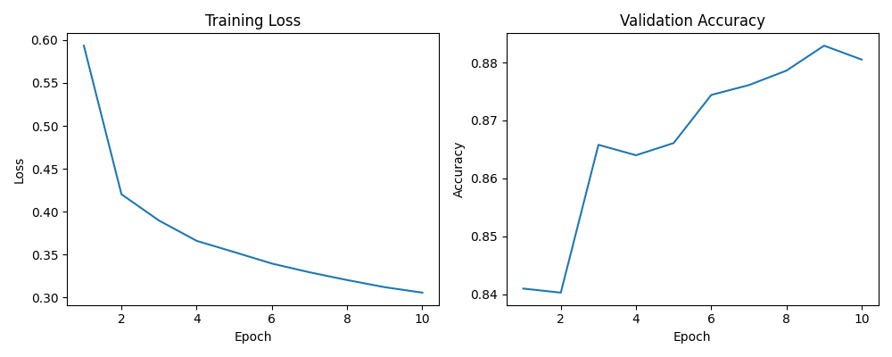
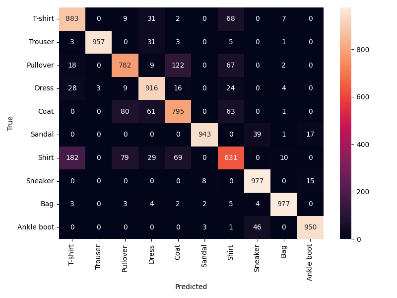
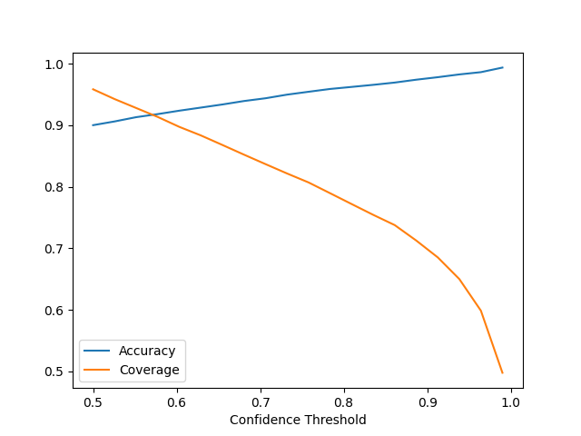

# Fashion-MNIST Image Classifier for StyleSort

## 📋 Business Problem

StyleSort is an online fashion retailer processing over 100,000 product listings per month with a 32% return rate. Customer surveys reveal that 40% of returns happen because products are miscategorized in the catalog.

**Examples of costly errors:**
- Formal Shirts listed as casual T-shirts
- Ankle boots categorized as Sandals  
- Coats listed as Pullovers

**Our task:** Build an automated image classification system to reduce misclassification and lower return rates.

---

## 🎯 Approach and Methodology

### Model Architecture

We implemented a feedforward neural network in PyTorch and tested three configurations:

| Model | Architecture | Dropout | Optimizer | Test Accuracy |
|-------|-------------|---------|-----------|---------------|
| Baseline | 784 → 128 → 10 | 0.0 | SGD | 82.81% |
| **Medium** | 784 → 256 → 128 → 10 | 0.3 | Adam | **88.11%** ⭐ |
| Deep | 784 → 512 → 256 → 128 → 10 | 0.4 | AdamW | 87.58% |

**Best model:** Medium (2-layer with Adam optimizer)

### Training Setup
- **Dataset:** Fashion-MNIST (60,000 train / 10,000 test)
- **Split:** 48,000 train / 12,000 validation / 10,000 test
- **Framework:** PyTorch with custom training loop
- **Batch size:** 64
- **Epochs:** 10
- **Loss:** CrossEntropyLoss

---

## 📈 Results Summary

### Key Metrics

| Metric | Value |
|--------|-------|
| **Test Accuracy** | **88.11%** ✅ |
| **Cost-Weighted Accuracy** | **89.14%** |

**✅ Exceeds business requirement of 85% accuracy**

### Training Curves



### Confusion Matrix



**Most confused pairs:**
- T-shirt ↔ Shirt: 250 errors (similar shapes, collar differences lost in 28×28)
- Pullover ↔ Coat: 202 errors (both outerwear, similar silhouettes)
- Shirt ↔ Pullover: 146 errors

### Confidence Threshold Analysis



**Recommendation: 0.75 threshold**
- 93% accuracy on accepted predictions
- 85% coverage (8,500 items/day auto-classified)
- 15% flagged for human review (1,500 items/day)

---

## 💼 Business Recommendations

### 1. Implementation Strategy
- Deploy with 0.75 confidence threshold
- Flag T-shirt/Shirt and Pullover/Coat predictions for priority review
- Expected return rate reduction from 32% to ~20%

### 2. Photography Guidelines
- **T-shirts vs Shirts:** Capture collar details clearly
- **Coats vs Pullovers:** Show full length, emphasize thickness
- **Footwear:** Side angle shots to show height differences

### 3. Product Descriptions
Add detailed text for confused categories emphasizing:
- Material specifications
- Fit descriptions  
- Usage context (office vs casual)

---

## 🚀 Setup and Running Instructions

### Installation

```bash
# Clone repository
git clone https://github.com/yourusername/mini-project-4.git
cd mini-project-4

# Install dependencies
pip install -r requirements.txt
```

### Run the Analysis

```bash
jupyter notebook notebooks/fashion_classifier.ipynb
```

The notebook will:
1. Download Fashion-MNIST automatically
2. Train three model configurations
3. Generate all visualizations in `results/`
4. Print accuracy metrics

**Training time:** ~10 minutes (CPU)

---

## 📁 Project Structure

```
mini-project-4/
├── README.md
├── requirements.txt
├── data/                          # Auto-downloaded
├── notebooks/
│   └── fashion_classifier.ipynb
├── src/
│   ├── model.py                   # FashionClassifier class
│   ├── train.py                   # Training loop
│   └── utils.py                   # Evaluation functions
└── results/
    ├── training_curves.png
    ├── confusion_matrix.png
    ├── confidence_threshold.png
    └── misclassified_examples.png
```

---

## 👥 Team Contributions

**Jacky**: Implemented core project structure (model.py, train.py, utils.py), Developed and trained neural network models in PyTorch, 
Designed training pipeline and evaluation workflow, Contributed to technical analysis and interpretation, Wrote final report

**Alex**: Conducted model architecture selection and comparison, Generated visualizations (training curves, images, results), Performed results analysis and interpretation, Created project documentation (README), Contributed to experimental evaluation and validation

---

## 📚 References

- Fashion-MNIST: https://github.com/zalandoresearch/fashion-mnist
- PyTorch Documentation: https://pytorch.org/docs/stable/index.html

---
