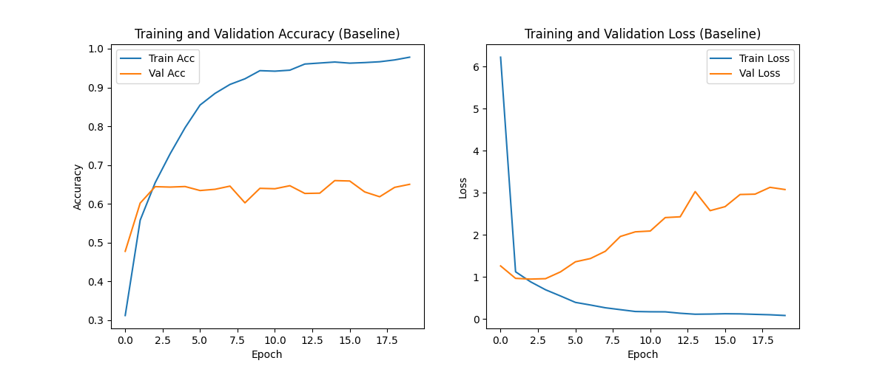
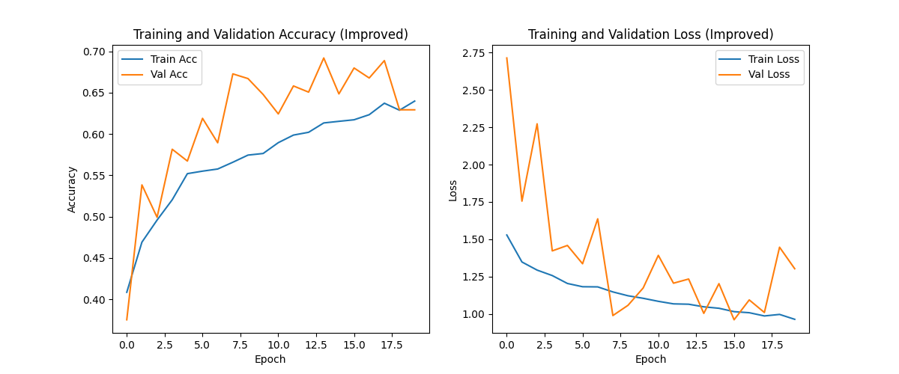
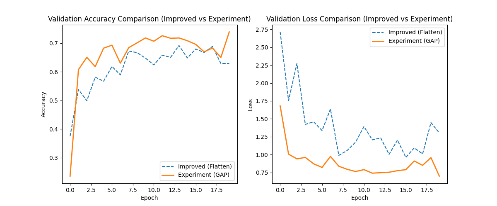
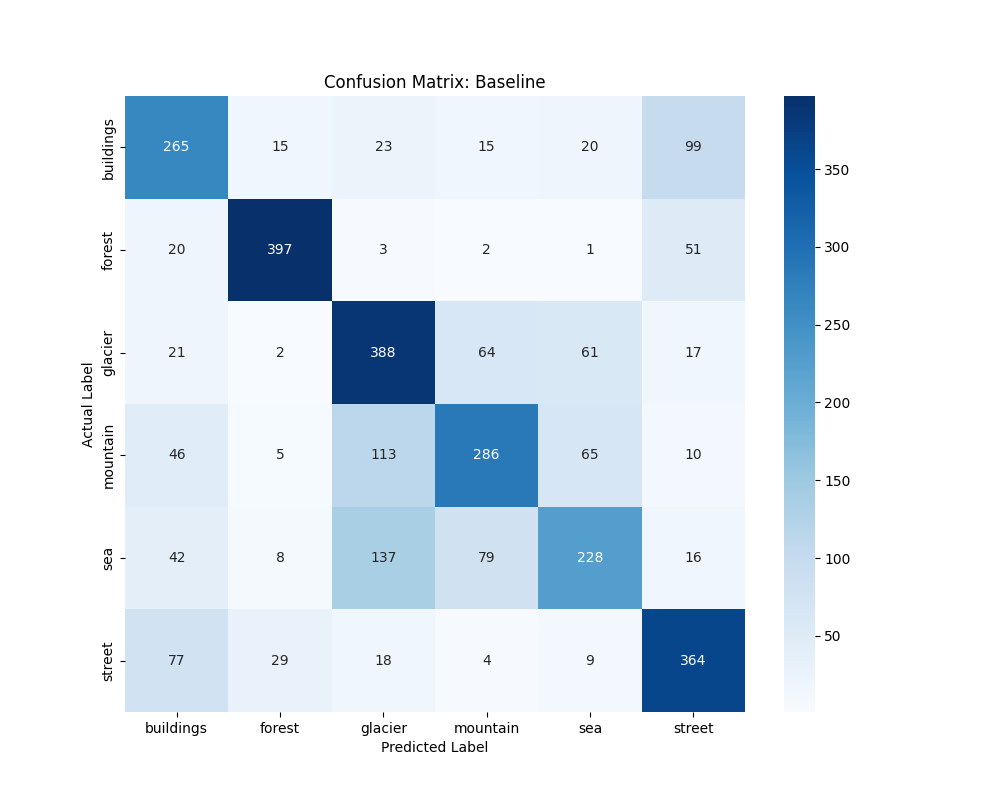
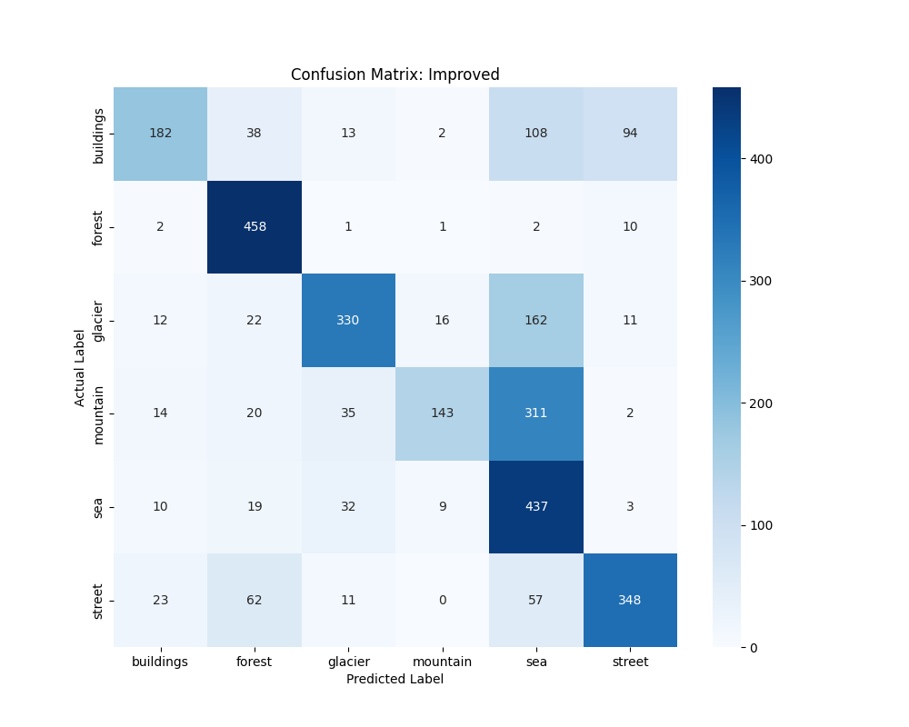
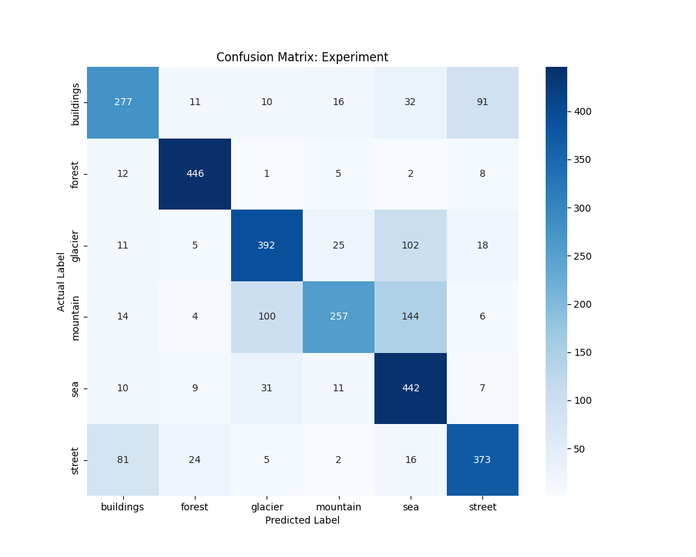
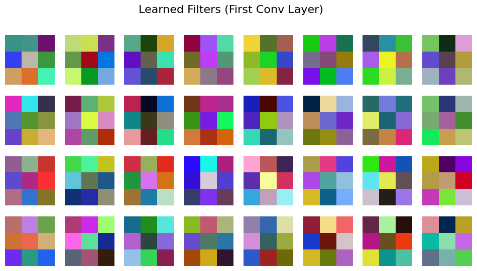
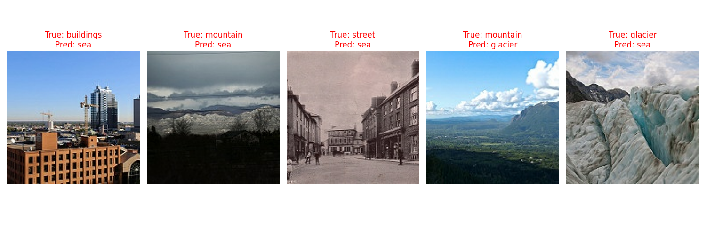

# Mini Project IV – Deep Learning Classifier

## Problem description and motivation

This project explores general image classification across distinct natural and urban scenes. The goal is to build a robust CNN capable of identifying specific environments such as mountains, streets, and glaciers. The motivation lies in handling a larger, multi-class dataset (6 classes) where certain categories, such as glaciers and mountains, share high visual similarities, requiring the model to learn detailed feature representations.

## Dataset description and source link

Dataset: Intel Image Classification (https://www.kaggle.com/datasets/puneet6060/intel-image-classification?resource=download)

The dataset contains 14034 images divided into 6 classes: buildings, forest, glacier, mountain, sea, and street.
It also contains 3000 images for testing.

## Setup instructions

    Download the dataset as zip file (363MB) from https://www.kaggle.com/datasets/puneet6060/intel-image-classification?resource=download
    Create a folder named 'data' in this repo.
    Unzip the arcive.zip file and move the 'arcive/seg_train', 'seg_test', 'seg_pred' folders (under 'arcive' folder) to the 'data' folder in this repo.

    git clone <this repo>
    cd AppliedAIProjects/mini-project-5
    python -m venv .venv
    source .venv/Scripts/activate or .venv/bin/activate
    pip install -r requirements.txt

run .ipynb files with a created python environment.

## Results Summary with Key Metrics

#### Model Performance Comparison

| Model Version | Train Acc | Val Acc | Train-Val Gap | Test Accuracy | Test F1 Score |
| :--- | :---: | :---: | :---: | :---: | :---: |
| **Baseline CNN** | 0.9781 | 0.6500 | 0.3281 | 0.6427 | 0.6400 |
| **Improved CNN** | 0.6399 | 0.6294 | 0.0106 | 0.6327 | 0.6207 |

#### Training Curves

#### Confusion Matrices

#### Learned Filters

#### Misclassifications

## Team Member Contributions
Group 10

Jacky Chen: Implemented the baseline CNN model and performed data exploration and preprocessing. Developed the improved (augmented) CNN model and authored the Learning Hub report, including methodology, results, and discussion.

Jun Park: Worked on the augmented CNN model, conducted model comparison and analysis, created visualizations (training curves, confusion matrices, CNN internals), implemented the experiment (GAP) model, and wrote the README.md file.

Together: Both members collaborated on cnn_classifier.ipynb, debugging, testing models, and ensuring reproducibility of the project.
